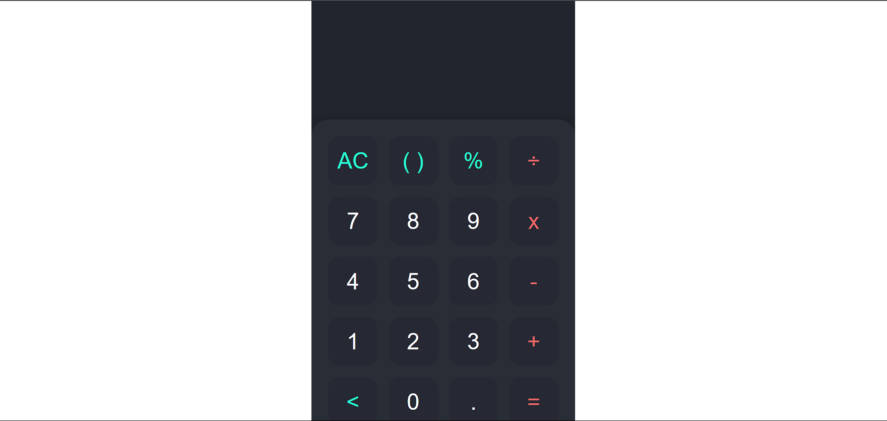

# Calci - A Simple Calculator

Calci is a simple and stylish calculator built using HTML, CSS, and JavaScript. It supports basic arithmetic operations and the use of parentheses for grouping.

## Features

- Basic arithmetic operations: addition, subtraction, multiplication, and division.
- Parentheses for grouping operations.
- Clear and backspace functionality.
- Responsive design.

## Screenshots



## Getting Started

### Prerequisites

To run this project locally, you need a web browser. No additional software is required.

### Installation

1. Clone the repository:
    ```bash
    git clone https://github.com/sridharreddyadina/Calci.git
    ```
2. Navigate to the project directory:
    ```bash
    cd Calci
    ```
3. Open `index.html` in your web browser.

## File Structure

- `index.html` - The main HTML file for the calculator interface.
- `main.css` - The stylesheet for the calculator's design.
- `main.js` - The JavaScript file containing the calculator's functionality.
- `screenshot.png` - Screenshot of the calculator.

## Usage

1. Click the numeric and operator buttons to input your calculation.
2. Use the `AC` button to clear the input and output.
3. Use the `<` button to delete the last character.
4. Use parentheses for grouping calculations.
5. Press the `=` button to compute the result.

## Code Overview

### HTML

Defines the structure of the calculator, including the display and key buttons.

### CSS

Styles the calculator to make it visually appealing and responsive.

### JavaScript

Handles the interaction between the user and the calculator. It updates the display based on user input and computes the result using the `eval` function.

## Contributing

Feel free to fork the repository and submit pull requests. For major changes or feature requests, please open an issue to discuss.


## Acknowledgments

- This project was inspired by various simple calculator designs and functionalities available online.

## Live Demo

You can view the live demo of the calculator at: [GitHub Pages Deployment](https://sridharreddyadina.github.io/Calci/)

---

For any questions or issues, please contact me via [GitHub](https://github.com/sridharreddyadina).

Happy calculating!
